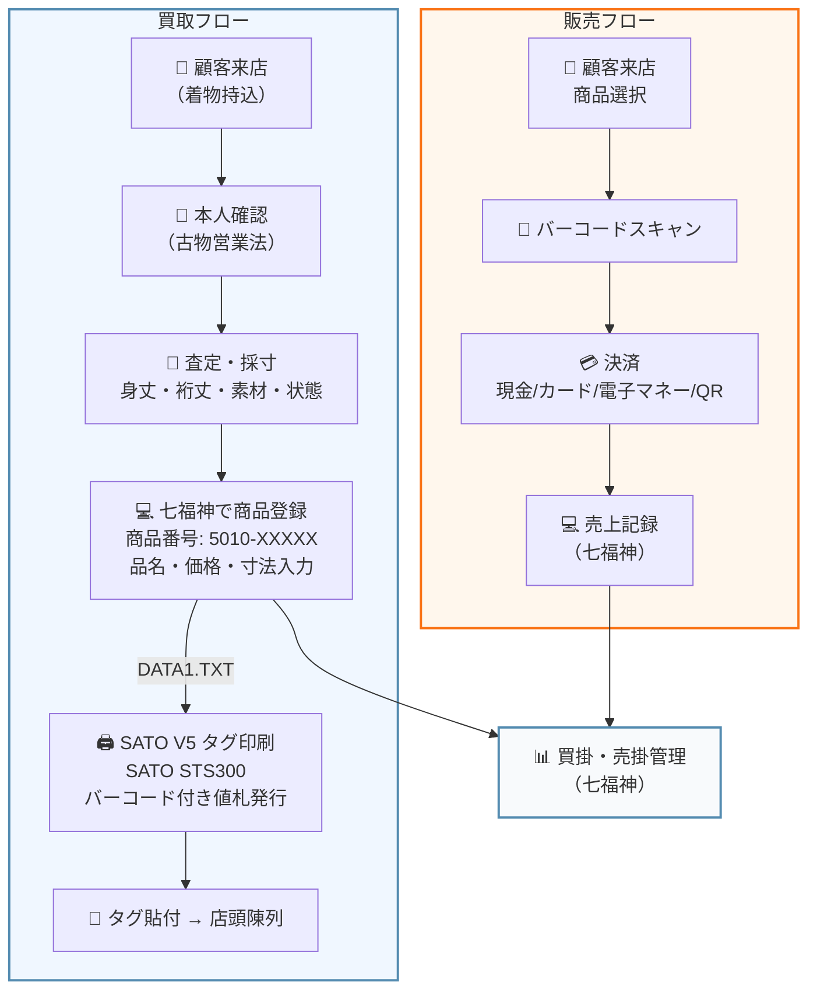

# 忠右衛門 現行フロー — 画像生成プロンプト

## プロンプト（日本語）

```
ビジネスフローチャートのインフォグラフィック。白背景、フラットデザイン、日本語テキスト。
タイトル「忠右衛門 — 現行業務フロー」

左から右に大きく2つのセクション「買取フロー」と「販売フロー」に分かれる。

【買取フロー（左側）】上から下に6ステップが矢印でつながる:

① 「顧客来店（着物持込）」— アイコン: 着物を持った人のシルエット
  ↓
② 「本人確認」— アイコン: 免許証。吹き出し「古物営業法」
  ↓
③ 「査定・採寸」— アイコン: メジャーとルーペ。吹き出し「身丈・裄丈・素材・コンディション」
  ↓
④ 「七福神で商品登録」— アイコン: PCモニター（青い画面に「七福神」ロゴ）。吹き出し「商品番号 5010-XXXXX / 品名・価格・寸法を入力」。PCからTXTファイルアイコンへ点線矢印「DATA1.TXT」
  ↓
⑤ 「SATO V5でタグ印刷」— アイコン: 白い業務用ラベルプリンター（SATO STS300）。TXTファイルからプリンターへ矢印。プリンターから出力される商品タグのイラスト（バーコード付き値札、品名¥54,780と記載）
  ↓
⑥ 「タグ貼付 → 店頭陳列」— アイコン: ハンガーラックに並んだ着物にタグが付いている

【販売フロー（右側）】上から下に4ステップ:

① 「顧客来店・商品選択」— アイコン: 着物を手に取る人
  ↓
② 「バーコードスキャン」— アイコン: ハンドスキャナーでタグを読み取る
  ↓
③ 「決済」— アイコン: レジ。吹き出し「現金/カード/電子マネー/QR」
  ↓
④ 「売上記録（七福神）」— アイコン: PCモニター（青い画面）

【中央下部に横長のボックス】
「買掛管理・売掛管理」— 七福神のアイコンとつながる。「仕入先への支払い管理」

【画面外の領域（点線の破線ボックス、グレーアウト）】
入荷〜査定の間に「ブラックボックス領域」と薄く表示。吹き出し「この工程はシステム外で進行中 → 2026年5月〜 Notion導入予定」

色使い: メインカラー #538bb0（青）、アクセント #f97316（オレンジ）、テキスト #1e293b。各ステップは角丸の白いカードに薄い影。矢印は青。ブラックボックス領域は薄いグレー破線。

スタイル: Clean flat infographic, business process flow, Japanese text, professional, minimal
```

## プロンプト（英語 — Midjourney/DALL-E向け）

```
A clean, professional business process flowchart infographic on white background. Japanese text labels. Title: "忠右衛門 — 現行業務フロー" (Chuemon - Current Business Flow).

The diagram splits into two main sections flowing top-to-bottom:

LEFT SECTION "買取フロー" (Purchase/Buying Flow) - 6 steps connected by blue arrows:
1. Customer arrives with kimono bundle — person silhouette with wrapped fabric
2. Identity verification — ID card icon, small badge "古物営業法"
3. Appraisal & measurement — magnifying glass and measuring tape icon, callout "身丈・裄丈・素材"
4. Register in "七福神" system — desktop PC with blue screen, callout showing product code "5010-XXXXX", dotted arrow to TXT file icon
5. Print tag via SATO V5 — white industrial label printer outputting a barcode price tag showing "¥54,780"
6. Attach tag & display in store — kimono hanging on rack with tag attached

RIGHT SECTION "販売フロー" (Sales Flow) - 4 steps:
1. Customer selects kimono
2. Barcode scan — handheld scanner reading tag
3. Payment — register icon with "現金/カード/電子マネー" callout
4. Sales record in "七福神" — PC screen

BOTTOM CENTER: horizontal box "買掛・売掛管理" connected to 七福神 system

DASHED GREY OVERLAY between steps 1-3 on left side labeled "ブラックボックス領域" (black box area) with note "システム外で進行 → Notion導入予定 2026.05"

Color palette: primary blue #538bb0, accent orange #f97316, dark text #1e293b. Each step is a white rounded card with subtle shadow. Arrows in blue. Black box area in light grey dashed border.

Style: flat design infographic, clean minimal, Japanese business document aesthetic, no 3D, no gradients, professional consulting presentation quality.
```

## Mermaid記法（ドキュメント埋め込み用）



## 注記
- ブラックボックス領域（入荷〜査定の工程管理）は現状システム外。2026年5月からNotion導入予定
- 七福神は商品化「後」の管理が中心
- SATO STS300 + SATO V5 で物理タグ（バーコード付き値札）を印刷
